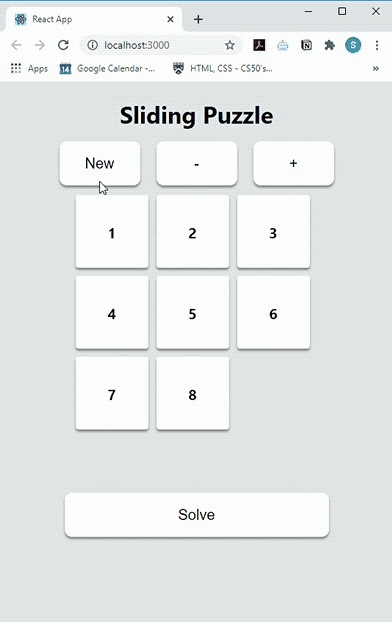

# Sliding Puzzle Solver

A ReactJS implementation of the classic 8 puzzle.

Allows the user to:
* Use the mouse to interact with the board. Clicking on a tile moves it into the empty slot. 
* Watch an animation of the optimal path to the solution.
* Shuffle the board to a new state.

## Implementation highlights
* Board generation guarantees the solveability of the initial board state.
    * _Note_: For an NxN board, there are N! possible configurations, of which only N!/2 are solveable. 
* A* Algorithm to solve the puzzle.
* Utility functions and solver code have been tested (albeit minimally).
* Minimalistic UI and modern animations . Used [FramerMotion](https://www.framer.com/api/motion/).
* The animation of the solution uses the `useInterval` React hook described in detail in this excellent [ article ](https://overreacted.io/making-setinterval-declarative-with-react-hooks/) by Dan Abramov.

# About

This is a side-project that I completed after working through Princeton's excellent Algorithms course, which served as my introduction to the use of A* to solve the board. My submission to the 8 puzzle assignment is found [here](https://github.com/mango-drive/data-structures-and-algorithms/tree/master/coursera-princeton/8puzzle). 

